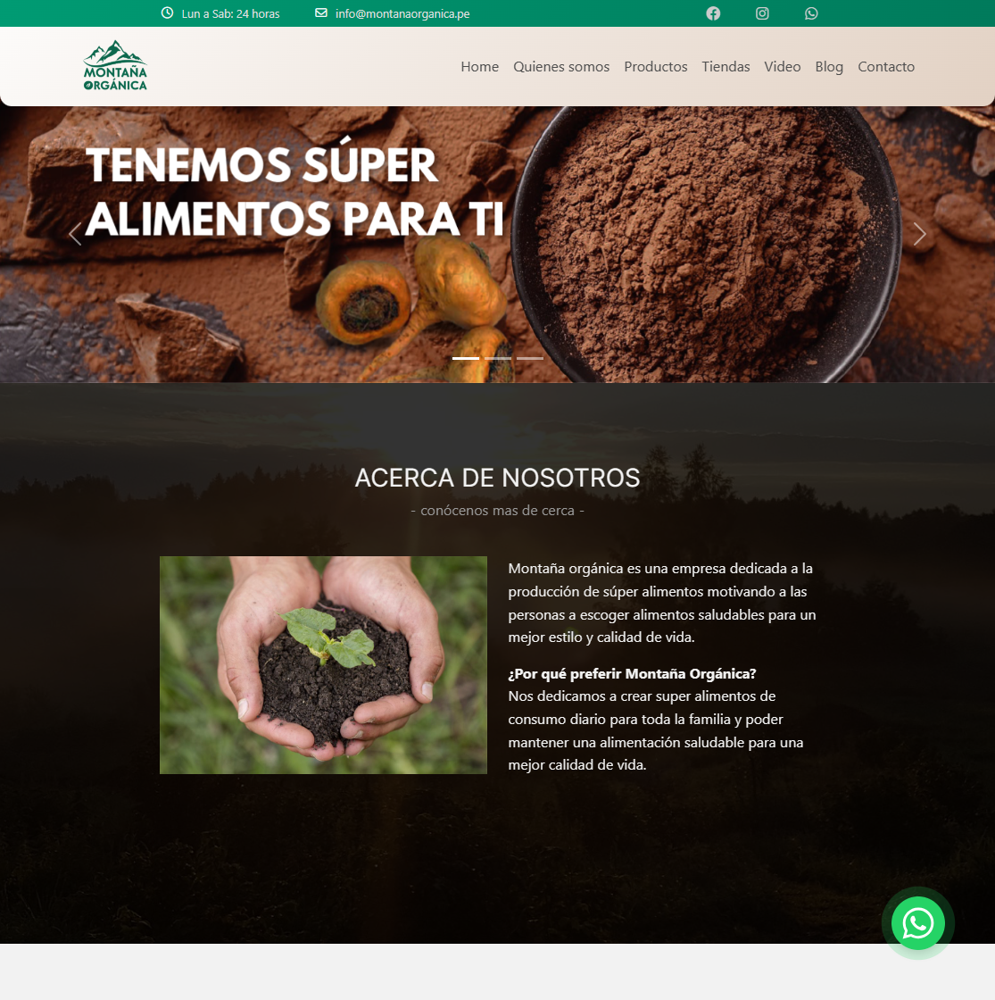

# Montaña Organica</>

## Contents

Landing page corporativo creado para la empresa de productos naturales Montaña Organica. Elaborado en React Js, Node.js, Vite y React-Bootstrap.
 Buscamos darle las herramientas básicas para que pueda dar a conocer sus productos a mas personas de una manera rápida y eficiente, minimalist e intuitiva al usuario.

## Website

Link : <https://awesome-github-readme-profile.netlify.app>

## Tecnologías utilizadas

- [ ] [Html](Html)
- [ ] [Css](Css)
- [ ] [Sass](Sass)
- [ ] [React](React)
- [ ] [JavaScript](JavaScript)
- [ ] [Bootstrap](Bootstrap)
- [ ] [Material_UI](Material-UI)
- [ ] [Animated.css](Animated.css)
- [ ] [AOS](AOS-Scroll-Animation)
- [ ] [EmailJs](EmailJs)
